# Get Healthy — 디자인 시스템 & UI 작업 규칙

이 문서는 두 가지 역할을 합니다.

1. **스펙** — `index.html`에 실제로 적용된 토큰(색·폰트·radius·간격)의 단일 출처.
2. **규칙** — 새 UI를 만들거나 고칠 때 *따라야 하는* 판단 기준. 지금까지 한 번씩 어긋나서
   재작업이 생겼던 항목들을 규칙으로 못박아둔 것이라, 여기만 지키면 같은 지적이 반복되지
   않습니다.

> **작업 전에 [§0 UI 작업 체크리스트](#0-ui-작업-체크리스트)부터 보세요.**
> 값이 필요하면 §1~§4, 패턴이 필요하면 §5~§6, "왜 또 깨졌지?" 싶으면 §7.

이 앱은 빌드 시스템이 없는 단일 `index.html`입니다. React 번들이 **이미 minify된 상태로**
`<script>` 안에 들어 있어서, 모든 수정은 그 문자열을 직접 편집하는 방식입니다. 그래서 일반적인
"컴포넌트 파일 열어서 고치기"가 안 되고, §7의 함정들이 실제로 자주 터집니다.

---

## 0. UI 작업 체크리스트

새 UI를 추가하거나 기존 UI를 고칠 때 **매번** 훑어야 하는 목록입니다.
(CLAUDE.md의 "UI작업시 얼라인은 기본으로 맞추기"를 구체화한 것)

### 정렬
- [ ] 두 요소의 **바닥선을 맞춰야 하면**, 부모에 `alignItems:"flex-end"`를 주는 것만으로
      끝내지 말 것. 자식 쪽에 §7-1의 두 함정(빈 스페이서 / 자식 자체 `minHeight`)이 없는지
      반드시 같이 확인.
- [ ] 값이 없을 수도 있는 텍스트 줄(메모·부가설명 등)은 **자리를 예약하지 말고 조건부 렌더**.
      `x && <div>...</div>` 형태. (§7-1)
- [ ] 아이콘 + 텍스트를 나란히 둘 땐 `display:"flex", alignItems:"center", gap:N`.
      `lineHeight:1`을 같이 주어 폰트 메트릭에 의한 미세 어긋남 제거.
- [ ] 줄바꿈되는(wrap) 레이아웃, 값이 2줄이 되는 경우까지 확인.

### 일관성
- [ ] 같은 행에 나란히 놓이는 컨트롤(예: 용량 드롭다운 + 복용 버튼)은 **높이·radius·보더
      두께·폰트 크기·폰트 굵기·배경 틴트를 전부 동일**하게. (§6-4)
- [ ] 새로 쓰는 색은 §1 팔레트에 있는 것만. 없으면 팔레트에 추가할지부터 결정.
- [ ] 파스텔 배경 위 텍스트 색은 직접 하드코딩하지 말고 **`ue(배경색)`** 사용. (§1)
- [ ] 폰트 크기는 §2 목록에 이미 있는 값에서 고르기. `.5` 단위 금지.
- [ ] 보더는 **실선(solid)**. 점선(dashed)은 이 앱에서 쓰지 않음. (§3)
- [ ] 폼 컨트롤(`button`/`input`/`select`/`textarea`)을 새로 넣었다면 폰트가 주변과 같은지
      `getComputedStyle`로 확인. 상속이 안 되는 요소들입니다. (§7-4)

### 접기/펼치기
- [ ] 디스클로저 삼각형 크기는 §5 규칙대로 (섹션=16, 그룹/행=18). 새로 만들지 말고 규격 따르기.
- [ ] 기본 열림/닫힘 상태가 §5 규칙에 맞는지 확인.
- [ ] 펼쳐진 상세 영역이 **뒷배경과 구분되는지** 확인. 색 있는 박스 안에서 펼쳐지면
      `background:"rgba(255,255,255,0.5)"`. (§5-4)
- [ ] 화살표는 `▾` 하나 + `rotate(180deg)`. `▴`/`▾` 글리프 교체 금지 (크기가 튑니다). (§5-1)
- [ ] 보여줄 상세가 없는 항목은 토글 자체를 렌더하지 않기. (§5-2)
- [ ] 접힘 애니메이션을 건드렸다면 같이 움직이는 요소가 **전부 같은 duration+curve**인지
      확인. 하나만 짧으면 급작스럽게 느껴집니다. (§5-3)

### 마무리 (생략 금지)
- [ ] `<script>` 태그 **3개 전부** `node --check`. (§7-5)
- [ ] Playwright로 실제 렌더 스크린샷 확인 + `pageerror`/`console.error` 0건. (§7-5)
- [ ] 정렬을 고쳤다면 **눈으로 보지 말고 `getBoundingClientRect()`로 수치 측정**해서
      0px인지 확인. (§7-1)
- [ ] 헤더를 건드렸다면 **주간기록/전체기록/분석 세 탭을 모두** 측정해서 같은 값인지 확인.
      한 탭만 고치면 탭 이동 시 제목이 튑니다. (§6-5)

---

## 1. 컬러

팔레트는 `c = {...}` 객체 하나가 유일한 출처입니다.

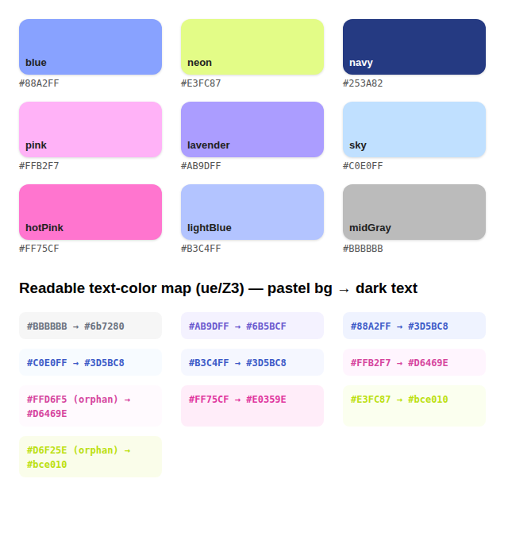

| 이름 | Hex | 주 용도 |
|---|---|---|
| `navy` | `#253A82` | 기본 텍스트/브랜드, 헤더 배경, primary 버튼 |
| `blue` | `#88A2FF` | 저녁(pm) 슬롯, 카드 그림자 틴트, 2.5mg 테마 |
| `hotPink` | `#FF75CF` | 아침(am) 슬롯 |
| `pink` | `#FFB2F7` | 5.0mg 테마, 음주 칩 |
| `lavender` | `#AB9DFF` | 필요시(prn) 슬롯, 복약 편집 액센트, 관리 화면 |
| `neon` | `#E3FC87` | 체중 카드, 목통증 칩, 업데이트 배너, 강조 |
| `sky` | `#C0E0FF` | 연한 배경/보더 |
| `lightBlue` | `#B3C4FF` | 연한 배경/보더 |
| `midGray` | `#BBBBBB` | 슬롯 없는 항목 fallback |

### 알파 접미사 규칙

hex 뒤에 2자리 알파를 붙여 쓰는 관습이 자리잡았습니다. 새로 만들 때도 이 단계를 쓰세요.

| 접미사 | 불투명도 | 용도 |
|---|---|---|
| `12` ~ `15` | ~7~8% | 컨트롤/행의 은은한 배경 틴트 |
| `20` ~ `2E` | ~13~18% | 배지 배경 |
| `66` | 40% | 보더 |

예: 복약 행의 활성 배경 `${c.lavender}12`, 용량/복용 컨트롤 배경 `${c.lavender}15`,
보더 `${c.lavender}66`, 슬롯 배지 배경 `sb[1]+"20"`.

### 텍스트 색은 반드시 `ue()`로

파스텔 배경 위에 얹을 어두운 텍스트 색은 **직접 고르지 말고** `ue = t => Z3[t] || t`를
호출합니다. 매핑 테이블 `Z3`:

```
#BBBBBB → #6b7280      #AB9DFF → #6B5BCF      #88A2FF → #3D5BC8
#C0E0FF → #3D5BC8      #B3C4FF → #3D5BC8      #FFB2F7 → #D6469E
#FF75CF → #E0359E      #E3FC87 → #bce010
```

> **왜 규칙인가**: 예전에 `G1` 칩이 이 매핑의 *절반만* 자체 하드코딩해서 갖고 있었고, 그 결과
> `hotPink`/`neon`을 배경으로 넘기면 **텍스트 색이 배경색과 같아져 글자가 사라지는** 버그가
> 있었습니다. 지금은 `G1`도 `ue()`를 직접 호출합니다. 새 컴포넌트도 반드시 그렇게.

### 회색 계열 (팔레트 밖, 용도 고정)

| Hex | 용도 |
|---|---|
| `#9ca3af` | 보조 텍스트, 비활성 라벨, 디스클로저 화살표 |
| `#6b7280` | 상세 설명 본문 |
| `#d1d5db` | **입력 요소** 보더 (텍스트/숫자 입력, 드롭다운) |
| `#e2e8f0` | 비활성 버튼 보더 |
| `#eef0f3` | **카드/행 컨테이너** 보더 (입력 요소와 구분되는 용도) |
| `#f8fafc` / `#f5f6fb` | 아주 연한 블록 배경 |

`#d1d5db`(입력)와 `#eef0f3`(컨테이너)의 구분은 **의도적**입니다. 섞어 쓰지 마세요.

---

## 2. 타이포그래피

### 폰트 패밀리 (1종 고정)

```
'Apple SD Gothic Neo','Noto Sans KR',sans-serif
```

React 본문·업데이트 배너·토스트 전부 동일. 새 스택을 도입하지 마세요.

> 작은따옴표 문자열 안에서 이 스택을 쓸 땐 폰트명을 **이스케이프된 큰따옴표**로 감싸야
> 합니다 (`\"Apple SD Gothic Neo\"`). 작은따옴표로 감싸면 문자열이 조기 종료되어
> 런타임 에러가 납니다. (§7-6)

### 폰트 크기 (현재 쓰이는 값, 사용 빈도순)

`11`(83) · `10`(47) · `14`(43) · `12`(42) · `13`(38) · `9`(20) · `15`(13) · `20`(12) ·
`18`(8) · `16`(6) · `8`(5) · `30`(3) · `22`(3) · `17`(1) · `21`(1)

**규칙**: `.5` 단위 금지. 위 목록에 없는 새 크기를 도입하지 말 것 —
필요해 보이면 가장 가까운 기존 값을 쓰세요.

### 역할별 크기 (하이어라키)

| 역할 | 크기 | 굵기 | 색 |
|---|---|---|---|
| 헤더 대제목 (전체 N주차) | 30 | 800 | 테마 |
| 섹션 카드 제목 (`w1`/`cw`) | 13 | 700 | `c.navy` |
| 항목 이름 (약 이름 등) | 13 | 700 | `c.navy` |
| 본문/버튼 라벨 | 12~14 | 600~700 | `c.navy` |
| 컨트롤 안 텍스트 (드롭다운/작은 버튼) | 11 | 700 | `c.navy` |
| 보조 설명 / 메타 | 10~11 | 400~600 | `#9ca3af` |
| 배지·칩 | 10~12 | 600~700 | `ue(배경색)` |
| 단위 첨자 (kg, % 등) | 8~9 | 500~600 | 상속 |

`lineHeight`는 한 줄짜리 UI 텍스트에 **`1`**을 명시하는 게 이 앱의 관습입니다
(폰트 메트릭 때문에 생기는 세로 어긋남 방지). 여러 줄 본문은 `1.4`~`1.5`.

---

## 3. 스페이싱 · 보더 · 그림자

### 그림자 (3종 고정)

```
0 3px 12px {blue}12   ← 모든 흰 섹션 카드
0 4px 16px {navy}30   ← 모든 모달
0 4px 16px rgba(0,0,0,.18)   ← 업데이트 배너 전용 (의도적 예외)
```

### 보더

- **항상 실선.** `dashed`는 현재 코드에 0곳 — 다시 도입하지 마세요.
- 두께는 `1.5px`가 기본(컨트롤·행), 얇은 구분선은 `1px`.
- 색은 §1 회색 표의 용도 구분을 따를 것.

### Border-radius (현재 값, 빈도순)

`12`(35) · `10`(29) · `20`(12) · `14`(10) · `8`(9) · `50%`(7) · `16`(7) · `18`(7) ·
`6`(5) · `22`(5) · `3`(4) · `2`(3) · `9`(2) · `5`(2) · `4`(2) + 차트 막대용 부분 radius

대략의 경향은 아래와 같습니다. 새로 만들 땐 여기 맞추세요.

| 대상 | radius |
|---|---|
| 섹션 카드 (`w1`/`cw`) | 18 |
| 모달 | 16~22 |
| 행 컨테이너 / 큰 버튼 | 12 |
| 입력·드롭다운·작은 버튼 | 8~10 |
| 배지 | 6 |
| 알약형 칩 (`G1`) | 20 |
| 원형 버튼 | `50%` |

> ⚠️ 전체를 하나의 스케일로 통일하는 작업은 아직 **미완**입니다 (§8-1).

### 버튼 높이

`44`(12곳) · `30`(8) · `40`(5) · `36`(5) · `34`(3) · `42`(3) …

- 폼 하단 주요 액션: `44`
- 행 안의 인라인 컨트롤: `30`
- 원형 내비 버튼: `34`

> ⚠️ 높이×radius 조합도 아직 통일 전 (§8-1).

---

## 4. 레이아웃

- 화면 기준 폭 **390px** (iPhone). 모든 검증은 이 폭에서.
- 섹션 카드 내부 패딩 `16`, 카드 사이 간격은 부모 스택의 `gap`.
- 행 내부 패딩 `10px 12px` 전후, 요소 간 `gap:6~8`.

### Grid를 쓸 때

`1fr` 트랙은 암묵적으로 `min-width:auto`라서, 내용(특히 `<input>`)이 트랙보다 넓으면
**부모를 밀고 나가 오버플로**합니다. 실제로 목표 수정 폼이 이것 때문에 깨졌었습니다.

```js
// ✗ gridTemplateColumns:"1fr 1fr"
// ✓
gridTemplateColumns:"minmax(0,1fr) minmax(0,1fr)"
```

---

## 5. 인터랙션 패턴 — 접기/펼치기

이 앱은 접기/펼치기가 많아서, 규격이 흔들리면 바로 눈에 띕니다.

### 5-1. 디스클로저 삼각형 규격

| 레벨 | 크기 | 색 | 예시 |
|---|---|---|---|
| **섹션** (`cw` 카드 헤더) | `fontSize:16` | `#9ca3af` | 신체측정, 생리, 복약, 특이사항, 메모 |
| **그룹 박스** (색 있는 하위 묶음) | `fontSize:18` | 그룹 액센트색 (`#6B5BCF`) | 필요시 · N개 |
| **행** (개별 항목 상세) | `fontSize:18` | `#9ca3af` | 약 이름 밑 "눌러서 상세" |

**공통 규칙**
- 글리프는 **항상 `▾` 하나만** 쓰고, 열린 상태는 `transform:"rotate(180deg)"` +
  `display:"inline-block"` (`transition:"transform 0.15s"`)로 표현합니다.
  **`▴`/`▾` 문자를 교체하는 방식은 금지** — 두 글리프는 폰트에서 크기가 달라서, 펼쳤을 때
  화살표만 갑자기 커집니다. 실제로 그 버그가 났습니다.
- 라벨과 화살표는 **분리된 `<span>`**으로 두고 `display:flex, alignItems:"center", gap:3`.
  라벨 문자열에 화살표를 문자로 이어붙이면 화살표가 라벨 폰트 크기에 묶여버립니다 —
  실제로 "눌러서 상세"의 화살표만 작았던 원인이 이것이었습니다.

### 5-2. 기본 열림/닫힘

| 대상 | 기본 상태 | 근거 |
|---|---|---|
| `cw` 섹션 | 내용이 있으면 열림 (`defaultOpen:!!(...)`) | 기록된 값은 바로 보여야 함 |
| 그룹 박스 (필요시) | **항상 닫힘** | 매일 쓰는 항목이 아님 |
| 행 상세 | **항상 닫힘** | 목록 훑기를 방해하지 않게 |

**보여줄 상세가 없으면 토글 자체를 렌더하지 마세요.** 빈 상세를 여는 화살표는 노이즈입니다.
복약 행 기준: `hd = items.length > 1 || !!effect` 일 때만 "눌러서 상세" 줄과 화살표를 렌더하고,
아니면 부제 줄 전체를 생략하고 `cursor`도 `default`로 둡니다.

### 5-3. 헤더 접힘 애니메이션 — 타이밍은 하나로

스크롤 시 헤더가 접힐 때 **같이 움직이는 요소가 4개**입니다. 이들이 서로 다른 duration을
쓰면 각각 다른 순간에 끝나서 "뚝뚝 끊긴다 / 급작스럽다"는 느낌이 납니다. 실제로 그랬습니다
(패딩 0.15s, 높이 0.38s, 크로스페이드 0.18s, 날짜 스트립 0.18s — 전부 제각각).

**규칙: 크기·위치가 변하는 것은 전부 같은 duration + 같은 curve.**

```js
duration: 0.42s
curve:    cubic-bezier(0.4,0,0.2,1)   // 표준 ease-in-out
```

- 적용 대상: 헤더 `padding`, 높이 컨테이너 `height`, 날짜 스트립의 `max-height`·`padding`.
- **커브 주의**: 예전의 `cubic-bezier(0.22,1,0.36,1)`(easeOutQuint)은 초반에 움직임의
  대부분을 소모해서, 부드럽다기보다 **튕기듯 급작스럽게** 읽힙니다. 크기 변화에는
  시작·끝이 모두 완만한 ease-in-out이 맞습니다.

**크로스페이드는 겹치지 말고 순차로.** 접힌 뷰와 펼친 뷰는 겹쳐 있는 두 레이어라,
동시에 페이드하면 중간에 둘 다 반투명으로 보여 지저분해집니다. 나가는 쪽을 먼저 지우고
들어오는 쪽을 늦게 넣으세요.

```js
// 펼친 레이어
transition:`opacity 0.2s ease ${hdrSc?"0s":"0.18s"}`
// 접힌 레이어 (반대)
transition:`opacity 0.2s ease ${hdrSc?"0.18s":"0s"}`
```

> 검증은 눈이 아니라 샘플링으로. 접히는 동안 `getComputedStyle`을 25ms 간격으로 찍어서
> 높이와 스트립 값이 **비례해서 같이 줄고 같은 프레임에 끝나는지** 확인하세요.

### 5-4. 펼쳐진 상세의 배경

색 있는 컨테이너 **안에서** 펼쳐지는 상세 영역은 배경이 겹쳐 읽기 어려워집니다.
반드시 흰색 반투명을 깔아 분리하세요.

```js
background:"rgba(255,255,255,0.5)"
```

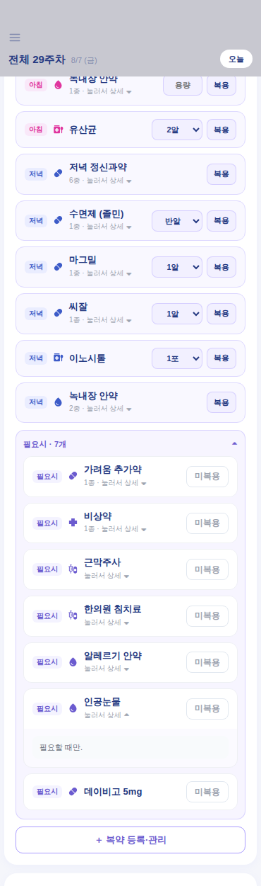

---

## 6. 컴포넌트 레시피

### 6-1. 섹션 카드 — `w1` / `cw`

```js
background:"#fff", borderRadius:18, padding:16, boxShadow:`0 3px 12px ${c.blue}12`
// 제목: fontWeight:700, fontSize:13, color:c.navy, lineHeight:1
```

`w1` = 고정, `cw` = 접기 가능(`defaultOpen` prop). 앱의 흰 카드는 전부 이 둘 중 하나입니다.
**새 카드를 직접 스타일링하지 말고 이 컴포넌트를 쓰세요.**

### 6-2. 알약형 칩 — `G1`

```js
display:"inline-flex", alignItems:"center", gap:5,
padding:"5px 12px 3px", borderRadius:20,
fontSize:12, fontWeight:600, lineHeight:1,
background: color+"2E", color: ue(color), border:`1px solid ${color}66`
```

패딩은 **px 고정값**입니다. `em`을 쓰면 폰트 크기 상속에 따라 칩마다 세로 패딩이 미묘하게
달라집니다 (예전에 그랬고 고쳤습니다).

### 6-3. 슬롯 배지 — 아침/저녁/필요시

**단일 출처는 `SB0`** (팔레트 `c` 바로 옆에 정의):

```js
var SB0 = { am:["아침", c.hotPink], pm:["저녁", c.blue], prn:["필요시", c.lavender] };
```

렌더 스타일:
```js
fontSize:10, fontWeight:700, color:ue(sb[1]), background:sb[1]+"20",
borderRadius:6, padding:"2px 6px", flexShrink:0
```

> 예전엔 이 맵이 요약 화면·편집 폼·관리 모달 3곳에 각각 복붙돼 있었습니다. 색을 바꾸려면
> 3곳을 다 고쳐야 했고 실제로 한 번 어긋났습니다. **`SB0`만 고치세요.**

### 6-4. 나란히 놓이는 컨트롤 쌍 (용량 + 복용)

같은 행에 붙어 있는 컨트롤은 **하나의 세트로 보여야** 합니다. 공통으로 맞출 항목:
`height` · `borderRadius` · 보더 두께 · `fontSize` · `fontWeight` · 배경 틴트 계열.

현재 매일 복용 행의 규격 (기준으로 삼으세요):

```js
// 용량 드롭다운
width:72, height:30, padding:"0 8px", borderRadius:8,
border:`1.5px solid ${c.lavender}66`, background:`${c.lavender}15`,
fontSize:11, fontWeight:700, color:c.navy, textAlign:"center", boxSizing:"border-box"

// 복용/거름 버튼 (복용 상태)
height:30, padding:"0 9px", borderRadius:8,
border:`1.5px solid ${c.lavender}66`, background:`${c.lavender}15`,
fontSize:11, fontWeight:700, color:c.navy

// 거름 상태만 색이 바뀜
border:"1.5px solid #F19AB0", background:"#FDECF1", color:"#D6469E"
```

**용량 칸을 언제 보여줄지**: 여러 성분이 묶인 약(`items.length > 1`)은 각 성분에 용량이
이미 적혀 있으므로 **용량 칸을 렌더하지 않습니다**. 단일 성분 약만 용량 컨트롤을 가집니다.
선택지가 정해진 약은 `doseOpts` 맵에 id를 등록해 `<select>`로, 그 외에는 자유입력
`<input>`으로 렌더됩니다.

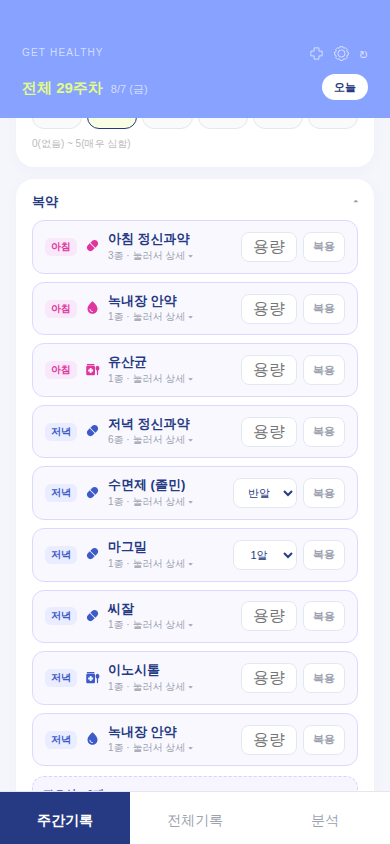

### 6-5. 헤더 (3개 탭 공통)

주간기록 / 전체기록 / 분석 **세 탭의 헤더는 동일한 골격**을 씁니다. 한 탭만 고치면 탭을
옮길 때 제목이 위아래로 튀므로, 값을 바꿀 땐 세 곳을 같이 바꾸세요.

측정 기준 (390px, 실제 데이터 기준으로 세 탭이 모두 같아야 함):

| 항목 | 값 |
|---|---|
| 대제목(30px) top | 112 |
| 부제목 bottom | 160 |
| 카드 top / bottom / height | 74 / 160 / 86 |
| 카드 bottom − 부제목 bottom | **0** |

카드 높이는 **항상 86 고정**입니다. 데이터 유무에 따라 높이나 패딩을 바꾸면
(`noWt?88:86` 같은 식) 탭마다 요소가 몇 px씩 움직입니다 — 실제로 그랬습니다.
부제목의 `lineHeight`도 세 탭 모두 `1`이어야 합니다. `1.4`를 주면 줄 상자 아래에 여백이
생겨 **눈에 보이는 바닥선만 어긋납니다.**

텍스트 블록과 카드의 **바닥선이 정확히 일치**해야 합니다. 이건 §7-1의 함정이 그대로
드러나는 자리라 특히 조심해야 합니다.

```js
// 부모 행
display:"flex", justifyContent:"space-between", alignItems:"flex-end", gap:12, minHeight:92
// 텍스트 블록 (자체 minHeight 금지!)
flex:1, display:"flex", flexDirection:"column", justifyContent:"flex-end"
// 체중 카드
width:82, height:86, borderRadius:14, background:c.neon, flexShrink:0
```

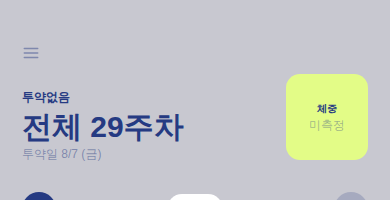

### 6-6. 햄버거 메뉴

헤더 좌상단 버튼 하나(18×18 svg, `strokeWidth:1.8`, `M3 6h18M3 12h18M3 18h18`)로 열립니다.
항목은 4개:

**투약 스케줄 관리 · 복약 설정 · 데이터 관리 · 목표 수정**

각 하위 모달에는 **`←` 뒤로가기 + `×` 닫기**가 나란히 있어야 합니다
(`display:flex, alignItems:center, gap:6`). 뒤로가기는 해당 모달을 닫고 메뉴를 다시 엽니다.

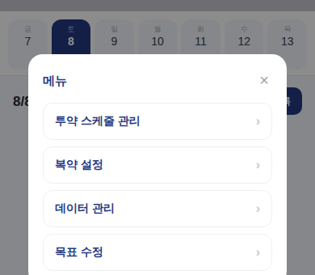

---

## 7. 알려진 함정 (실제로 터졌던 것들)

### 7-1. ⭐ 보이지 않는 스페이서가 바닥 정렬을 깬다

**증상**: `alignItems:"flex-end"`를 줬는데도 두 요소의 바닥선이 안 맞음.

**원인 A — 빈 내용에 자리를 예약한 경우** (헤더 정렬이 4번이나 재보고된 진짜 원인):

```js
// ✗ 메모가 없어도 minHeight:14 + marginTop:4 = 18px를 계속 차지 →
//   눈에 보이는 마지막 줄이 바닥에서 18px 위에서 끝남
<div style={{fontSize:11, marginTop:4, lineHeight:1, minHeight:14}}>
  {F.memo ? `※ ${F.memo}` : ""}
</div>

// ✓ 있을 때만 렌더
{F.memo && <div style={{fontSize:11, marginTop:4, lineHeight:1}}>{`※ ${F.memo}`}</div>}
```

**원인 B — flex 자식이 자기 `minHeight`로 행 높이를 꽉 채운 경우**:
자식 높이가 행 높이와 같아지면 남는 공간이 0이라 부모의 `alignItems`가 **아무 일도 하지
않습니다.** 자식의 `minHeight`를 없애고, 자식 *자신의* `justifyContent`를 `flex-end`로.

**검증법**: 눈으로 보지 말고 수치로 재세요.
```js
Math.round(card.getBoundingClientRect().bottom - line.getBoundingClientRect().bottom) // === 0
```

### 7-2. Grid `1fr` 오버플로

§4 참고. `minmax(0,1fr)` 사용.

### 7-3. 라벨에 화살표를 문자로 이어붙이지 말 것

`"...상세" + (open ? " ▴" : " ▾")` 처럼 쓰면 화살표가 라벨의 `fontSize`에 묶여서 따로 못
키웁니다. §5-1대로 `<span>`을 분리하세요.

### 7-4. ⭐ 폼 컨트롤은 페이지 폰트를 상속하지 않는다

`<button>` / `<input>` / `<select>` / `<textarea>`는 **`font-family`를 상속하지 않습니다.**
그냥 두면 버튼만 Arial로 렌더돼서, 바로 옆 요소와 글자 모양이 미묘하게 다릅니다.
head의 리셋에 아래가 들어 있어야 합니다.

```css
button,input,textarea,select{font-family:inherit}
```

또 하나 — iOS의 포커스 확대를 막으려고 넣은 아래 규칙이 **인라인 스타일까지 덮어써서**
앱의 모든 input을 16px로 강제하고 있었습니다.

```css
/* ✗ !important가 인라인 fontSize를 전부 무력화 */
input,textarea{font-size:16px!important}
/* ✓ 기본값으로만 두면 인라인 지정이 이깁니다 */
input,textarea{font-size:16px}
```

이 앱은 viewport에 `user-scalable=no,maximum-scale=1.0`이 있고 standalone PWA로 실행되므로
`!important` 없이도 포커스 확대가 일어나지 않습니다.

> **교훈**: "인라인 스타일을 줬는데 왜 안 먹지?" 싶으면 head의 리셋 CSS에 `!important`가
> 있는지 확인하세요. 눈으로 비교하지 말고 `getComputedStyle(el).fontSize`로 실제 값을
> 찍어보면 바로 드러납니다.

### 7-5. `<script>` 태그가 3개다

| # | 내용 |
|---|---|
| 0 | 헤드 스크립트 (~2.4KB) |
| 1 | React 번들 (~420KB) |
| 2 | PWA/서비스워커 등록 + 업데이트 배너/토스트 (~1.6KB) |

**셋 다** `node --check` 해야 합니다. 실제로 런타임 버그 2건이 스크립트 **2번**에서 났고,
1번만 검사하던 동안에는 전혀 보이지 않았습니다.

```bash
python3 - <<'EOF'
import re, subprocess
data = open('index.html', encoding='utf-8').read()
for i, s in enumerate(re.findall(r'<script[^>]*>(.*?)</script>', data, re.S)):
    open(f'/tmp/s{i}.js','w',encoding='utf-8').write(s)
    r = subprocess.run(['node','--check',f'/tmp/s{i}.js'], capture_output=True, text=True)
    print(i, 'OK' if r.returncode==0 else 'FAIL', r.stderr[:400])
EOF
```

### 7-6. 문자열 인코딩이 파일 안에서 섞여 있다

같은 한글이라도 어떤 곳은 리터럴 UTF-8(`"필요시"`), 어떤 곳은 JS 유니코드 이스케이프
(`"\uD544\uC694\uC2DC"` — 백슬래시가 파일에 그대로 들어 있음)로 저장돼 있습니다. 그래서:

- 치환 전에 **반드시 `data.count(old)`로 정확히 1인지 확인**하고 진행할 것.
- 에디터의 퍼지 매칭에 의존하지 말고 Python으로 읽기→치환→쓰기.
- 작은따옴표 문자열 안의 폰트명은 `\"`로 이스케이프 (§2).

### 7-7. 배포가 안 된 것처럼 보일 때

- GitHub Pages의 source 설정이 조용히 풀려서 머지해도 재빌드가 안 된 적이 있습니다.
- 서비스워커가 이전 버전을 캐시해 사용자에게 옛 화면이 보일 수 있습니다
  (`sw.js`가 `UPDATE_AVAILABLE`을 보내면 배너가 뜹니다).
- 즉 "고쳤는데 반영이 안 됐다"는 보고를 받으면, 코드를 의심하기 전에
  `git show origin/main:index.html`로 **배포 브랜치에 실제로 들어갔는지부터** 확인하세요.

---

## 8. 남은 불일치 (backlog)

의도적으로 미룬 것들입니다. 새 작업이 여기에 발목 잡히지 않도록 상태를 명시해둡니다.

1. ⚠️ **Border-radius / 버튼 높이 전체 스케일 통일** — radius 15종, 높이 40종이 60곳 넘게
   흩어져 있습니다. 카드/배지/버튼마다 의도가 조금씩 달라서, 용도 확인 없이 일괄 치환하면
   깨질 위험이 큽니다. §3의 "경향" 표를 지키는 선에서 운영하고, 통일은 별도 라운드에서
   하나씩 확인하며 진행할 것.
2. ⚠️ **필요시 행의 복용 버튼만 규격이 다름** — 매일 복용 행은 `fontSize:11` + lavender
   틴트로 통일했지만, 필요시 행의 복용/미복용 버튼은 `fontSize:12` + navy 계열입니다.
   상태 의미(복용 여부 토글)가 달라서 일부러 남겨뒀는데, 통일하고 싶으면 §6-4 규격으로
   맞추면 됩니다.
3. ⚠️ **폰트 크기 16종** — `.5` 파편은 정리됐지만 완전한 타입 스케일(예: 10/12/14/16/20)
   까지 좁히지는 않았습니다. §2의 역할별 표를 지키는 선에서 운영 중.
4. ⚠️ **아이콘 관련 3건은 의도적으로 유지** — 사용자가 직접 고른 것들이라 건드리지 않습니다.
   - `syringe`와 `kit`이 동일 경로(Material `mixture_med`)를 씀
   - `A2`는 아이콘별 `fillRule` 예외가 있고 `D2`는 항상 `evenodd` 고정
   - `D2`(증상) 17종은 Material 미전환(손으로 그린 경로)

---

## 9. 아이콘

렌더러가 2개입니다. 둘 다 `0 0 24 24` grid.

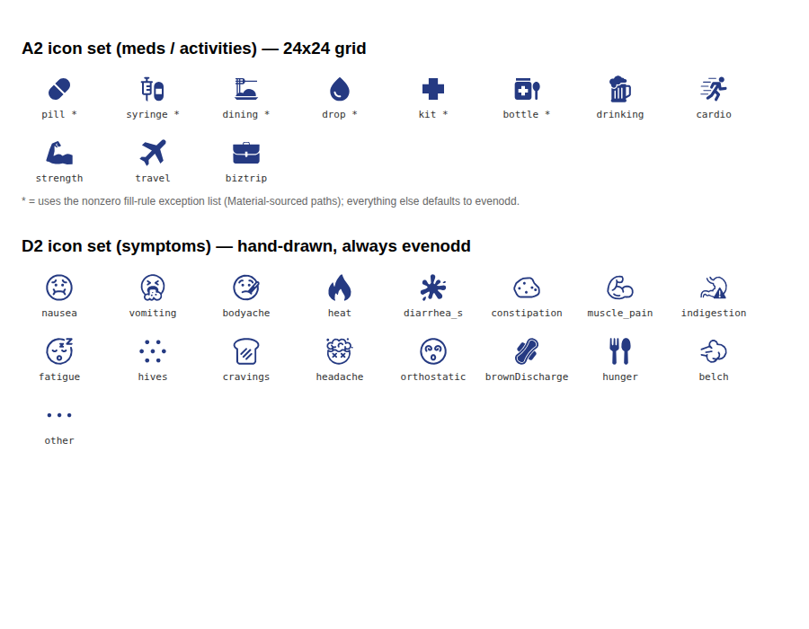

- **`A2`** (복약/활동) — `pill*`, `syringe*`, `dining*`, `drop*`, `kit*`, `bottle*`,
  `drinking`, `cardio`, `strength`, `travel`, `biztrip`
  (`*` = 구글 Material Symbols 실데이터)
- **`D2`** (증상) — `nausea, vomiting, bodyache, heat, diarrhea_s, constipation,
  muscle_pain, indigestion, fatigue, hives, cravings, headache, orthostatic,
  brownDischarge, hunger, belch, other` (전부 손으로 그린 경로)

### 새 아이콘 추가 절차 (CLAUDE.md와 동일)

1. fonts.google.com/icons (Material Symbols, Outlined/Filled)에서 **실제 아이콘을 검색**.
   직접 그리지 말 것.
2. `@material-symbols/svg-400` npm 패키지에서 `d` 경로 데이터를 꺼냄.
   (unpkg.com·\*.github.io는 샌드박스 egress에 막혀 있음. npm 레지스트리는 가능)
3. Material의 `0 -960 960 960` 좌표계를 앱의 `0 0 24 24`로 변환:
   ```js
   svgpath(d).translate(0,960).scale(0.025).round(3).toString()
   ```
4. `A2`의 아이콘 맵에 추가. 렌더가 이상하면 `fillRule` 예외 목록(`evenodd`)에 추가.

---

## 10. 화면 스크린샷

### 홈 / 일일 기록
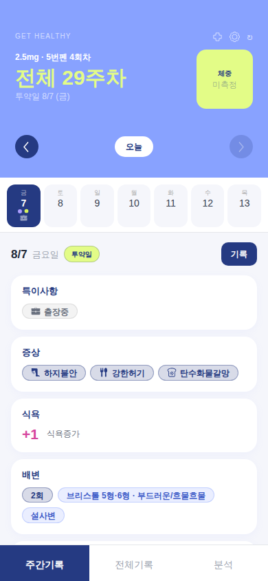

### 복약 요약 (카테고리별 한 줄)
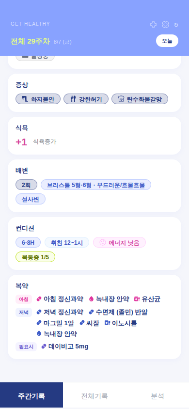

### 복약 편집 — 기본 (아침→저녁→필요시, 필요시는 접힘)


### 복약 편집 — 필요시 펼침 + 항목 상세 펼침


### 복약 관리 모달
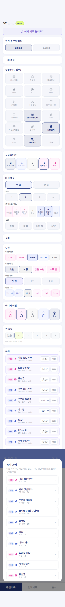

### 전체기록 탭
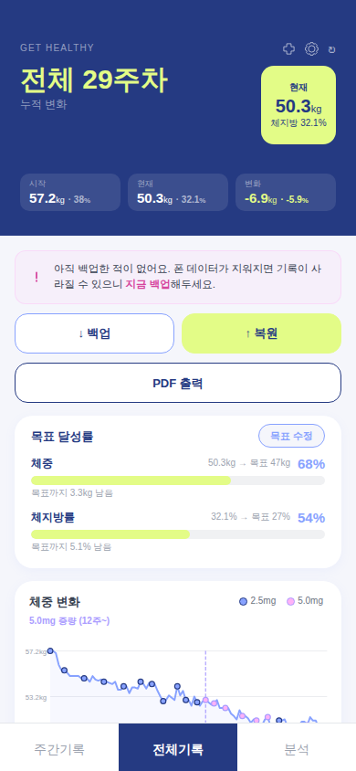

### 분석 탭
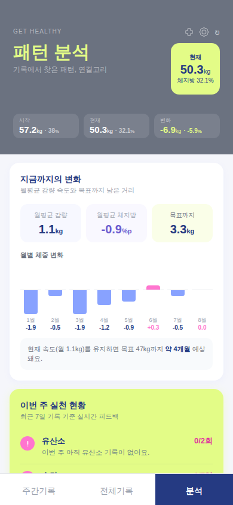

헤더 테마는 전체기록/분석 탭 모두 navy로 통일돼 있습니다.
